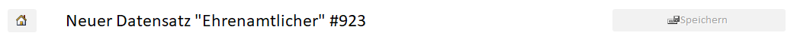
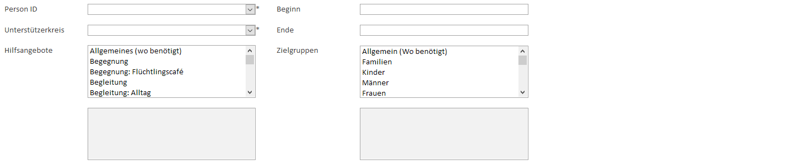
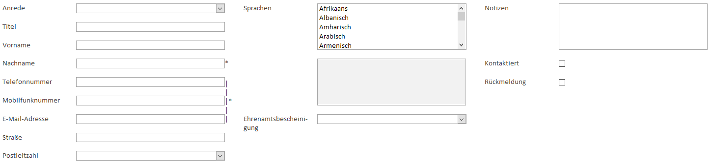
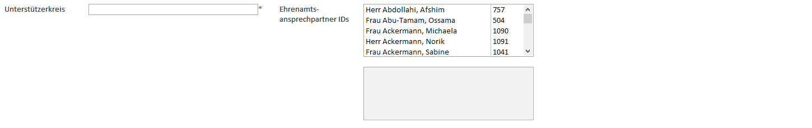
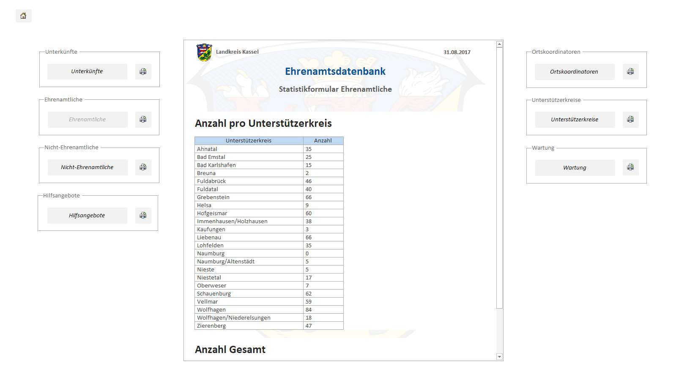

# EhraDB
Eine Datenbank zur Ehrenamtsverwaltung im Bereich Füchtlinge des Landkreises Kassel.


## Inhaltsverzeichnis
1. **[Einleitung](#Einleitung)**
2. **[Funktionalität](#Funktionalität)**
3. **[Code](#Code)**
4. **[Wartung](#Wartung)**
5. **[Zukunft](#Zukunft)**

<a name="Einleitung"></a>

## Einleitung
Die **EhraDB** entstand zum größten Teil im Rahmen eines Bundesfreiwilligendienstes beim Landkreis Kassel. Sie soll einen Überblick über alle ehrenamtlichen Helfer und ihre Tätigkeitsbereiche geben und als Nachschlagemöglichkeit für Kontaktdaten genutzt werden können.

Die Initiative für dieses Projekt setzte Ehrenamtskoordinator **Wolfgang Engelmohr**, der auch einen ersten Prototypen mit einigen Datensätzen bereitstellte. Innerhalb von acht Monaten (01/17 - 08/17) arbeitete **Jonas Thelemann** diese Grundidee bis hin zu einer sehr umfangreichen Form mit überaus zahlreichen Funktionen aus. Für den weiteren Support steht **Peter Brockmann** zur Verfügung. Der nächste Bundesfreiwilligendienstler **Luca Reining** wird die Datensätze pflegen.

<a name="Funktionalität"></a>

## Funktionalität
Im Hauptmenü der **EhraDB** stehen drei Bereiche zur Auswahl:

- **Eingabe**
- **Bearbeitung**
- **Statistikformulare**


### Eingabe
Die **Eingabe**-Ansicht ermöglicht neue Daten einzugeben. In der Kopfzeile befindet sich ein Button zur Navigation zurück ins Hauptmenü, ein Text-Indikator zum nächsten Datensatz der jeweiligen Kategorie und ein Button zum Speichern des neuen Datensatzes.



Darunter befindet sich ein Registersteuerelement, über das die neuen Datensätze angelegt werden können.


Verpflichtend einzutragende Felder sind jeweils duch einen Stern markiert, der in Verbindung mit dem `|`-Zeichen auch für eine Gruppierung von verpflichtend einzutragenden Feldern stehen kann. Der **Speichern**-Button kann nur dann angeklickt werden, wenn alle Mindestanforderungen für einen neuen Eintrag erfüllt sind. Beim Speichern wird auch überprüft, ob schon ein ähnlicher Eintrag existiert. Ist dies der Fall, wird dem Nutzer die Möglichkeit gegeben, das Eintragen abzubrechen.

1. **Ehrenamtliche**

    Hier kann eine neue ehrenamtlich arbeitende Person eingetragen werden.

    - Person ID
    - Unterstützerkreis
    - Hilfsangebote
    - Beginn
    - Ende
    - Zielgruppen

    

2. **Hilfsangebotsspezifizierungen**

    Hilfsangebote, die eine ehrenamtlich arbeitende Person leisten kann, werden in Kategorien mit optionaler Spezifizierung angegeben. Sollte sich eine neue Tätigkeit auftun, kann diese hier hinzugefügt werden.

    - Kategorie
    - Spezifizierung

    

3. **Personen**

    Eine Person ist die kleinste erforderliche Einheit im Rahmen der **EhraDB**. Sie kann dann als ehrenamtlich arbeitende Person oder als Ansprechpartner für verschiedene Bereiche markiert werden.

    - Anrede
    - Titel
    - Vorname
    - Nachname
    - Telefonnummer
    - Mobilfunknummer
    - E-Mail-Adresse
    - Straße
    - Postleitzahl
    - Sprachen
    - Ehrenamtsbescheinigung
    - Notizen
    - Kontaktiert
    - Rückmeldung

    

4. **Unterkünfte**

    Die Zahl der Unterkünfte ist derzeit rückläufig im Landkreis Kassel.

    - Typ
    - Name
    - Straße
    - Postleitzahl
    - Kapazität
    - Kleiderkammer
    - Hauptansprechpartner ID
    - Hauptmitarbeiter IDs
    - Notizen

    

5. **Unterstützerkreise**

    Hier befinden sich Eingabemöglichkeiten zu Beschwerdeinformationen, die (Leistungs-)Vermittelbarkeit einschränken können.

    - Unterstützerkreis
    - Ehrenamtsansprechpartner IDs

    

### Bearbeitung

Die **Bearbeitung**-Ansicht ermöglicht bereits hinzugefügte Daten zu verändern. In der Kopfzeile befindet sich ein Button zur Navigation zurück ins Hauptmenü. Der Text-Indikator zum aktuellen Datensatz der jeweiligen Kategorie, ein Button zum Speichern des neuen Datensatzes, vier Buttons zum Navigieren zwischen den Datensätzen und Dropdown-Suchoptionen befinden sich in den Unterformularen. Darunter befindet sich ein Registersteuerelement, über das die neuen Datensätze angelegt werden können.


**Hinweis**  
Diese Ansicht sollte auch immer vor der Eingabe eines neuen Datensatzes zu Hilfe genommen werden, um zu überprüfen, ob nicht ein solcher Eintrag schon existiert!

Die Unterformulare der **Bearbeitung**-Ansicht enthalten die gleichen Eingabeelemente wie die **Eingabe**-Ansicht (s.o.).

#### Eingabehilfen
Eine besondere Funktion stellen die doppelten Listenelemente dar. Bei langen Auswahllisten kann es einfach vorkommen, dass nicht auf den ersten Blick ersichtlich ist, welche Elemente ausgewählt sind. Dafür existiert eine zweite, graue Liste unter der Auswahlliste, die alle in der oberen Liste ausgewählten Elemente anzeigt.


### Statistikformulare
Hier können alle Statistiken zu den eingetragenen Daten angesehen und gedruckt werden. Zum zuletzt bekannten Zeitpunkt waren aber noch keine Daten eingetragen, sodass nur Statistiken zu den Stammdaten erstellt wurden. Sie zeigen welche Möglichkeiten es bei der Erstellung von weiteren Statistiken gibt.



**Hinweis**  
Die im Screenshot sichtbaren Statistiken müssen nicht representativ sein!
Außerdem gilt: Für aussagekräftige Statistiken sind vollständige Datensätze nötig. Statistiken bilden ein relatives Verhältnis ab, das anderweitig nicht gegeben sein kann.

<a name="Code"></a>

## Code & Tabellen
In den Ordnern `Code` und `Tabellen` befinden sich der VBA-Code, der die erweiterte Funktionalität der Datenbank stellt, und zwei Textversionen der Datenbanktabellen: in .csv- und .md-Format. Sie sollen als Hilfestellung für eigene Projekte dienen.

<a name="Wartung"></a>

## Wartung
Sollten Fehler auftauchen oder weitere Funktionen benötigt werden, die über die bereits gegebenen, zugreifbaren hinaus gehen, sollte jemand mit tiefen Access-Kenntnissen angesprochen werden. Die Wahrscheinlichkeit ist groß, dass sonst Änderungen vorgenommen werden, die zu unbeabsichtigten Auswirkungen, wie neue Fehler, bis hin zum Datenverlust führen können.

Die Datenstruktur auf dem Server ist folgende:

```
G:\...\
└── Datenbanken\
    └── Ehrenamtsdatenbank\
        ├── Ressourcen\
        │   ├── DB\
        │   │   └── EhraDB_20170831.accdb
        │   └── Icons\
        │       ├── EhraDB.jpg
        │       ├── EhraDB.png
        │       ├── EhraDB_2.jpg
        │       ├── EhraDB_2.png
        │       ├── EhraDB_2_jpg.ico
        │       ├── EhraDB_2_png.ico
        │       ├── EhraDB_jpg.ico
        │       └── EhraDB_png.ico
        └── EhraDB.lnk
```

Empfehlenswert ist von Zeit zu Zeit ein Backup der Datei `EhraDB_20170831.accdb` anzulegen. Die Datei muss auch an den die Datei Wartenden versendet werden. Besser ist es, wenn Fehler vor Ort, beim Landkreis, behoben bzw. Funktionen vor Ort hinzugefügt werden. So ist sichergestellt, dass nicht zwei Personen gleichzeitig Änderungen an derselben Datenbank vornehmen.

Der Zugriff auf Bearbeitungselemente in Access muss über einen Umweg erreicht werden: Über das Menü **Datei** > **Datenschutzoptionen** öffnet sich der Optionsdialog. Hier kann links unter **Aktuelle Datenbank** alle Einstellungen vornehmen. Zum Bearbeiten empfiehlt sich folgende Konfiguration:

- [x] Statusleiste anzeigen
- [x] Dokumentregisterkarten anzeigen
- [x] Access-Spezialtasten verwenden
- [ ] Beim Schließen komprimieren
- [x] Navigationsbereich anzeigen
- [x] Vollständige Menüs zulassen

Für normale Benutzer der Datenbank empfiehlt sich die inverse Konfiguration.

<a name="Zukunft"></a>

## Zukunft
Wie es mit der **[AsylDB](https://github.com/dargmuesli/asyl-db)** und der **EhraDB** genau weitergeht ist nicht bekannt. Ich, Jonas Thelemann, freue mich, dass ich die Datenbanken noch innerhalb meiner Dienstzeit zu meiner Zufriedenheit und der meiner Kollegen fertigstellen konnte. Da sich der gesamte Asyl-Bereich beim Landkreis aber verkleinert (positive Gründe, negative Auswirkungen), besteht die Gefahr, dass die Datenbank nicht mehr groß zur Anwendung kommt. Nichtsdestotrotz habe ich bei der Arbeit daran sehr viel gelernt und das ist, was zählt!
